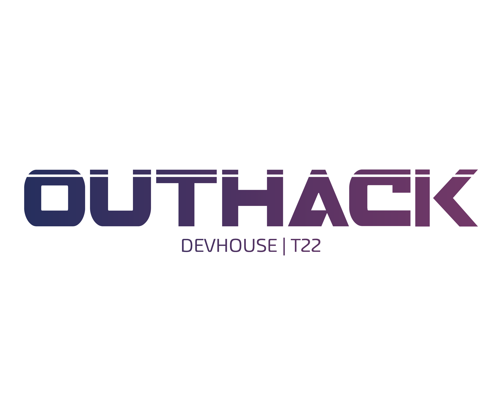

# 🔆 <strong>Boas vindas ao repositório do Hackathon T22!</strong>

## Sobre a Klever

A [Klever](https://klever.finance/) é uma empresa de soluções e serviços digitais no universo das Blockchains e Criptomoedas.
Com mais de 3 milhões de usuários em mais de 190 países do mundo, a Klever conta com uma comunidade ativa que se envolve, compartilha e vivencia experiências diariamente, utilizando os produtos Klever que estão traduzidos para mais de 30 idiomas.
Na Klever é possível desenvolver uma gama de serviços e produtos voltados para a tecnologia Blockchain. Na sua história começaram como uma Carteira de Criptoativos, e agora já é Corretora (Exchange), Blockchain, Incubadora, Mercado de NFT e muito mais.
Para Klever, liberdade financeira e tecnológica não devem ter limites, assim como cada um dos seus clientes.

## 💻 Sobre o projeto

Esse repositório contém uma aplicação desenvolvida para o Hackathon da [Trybe](https://www.betrybe.com/) em parceria com a [Klever](https://klever.finance/). O desafio proposto foi desenvolver uma aplicação FrontEnd que utilize a Klever Browser Extension.

A solução proposta à Klever foi o desenvolvimento de um programa de fidelização, chamado Klever Cashback que possa ser utilizado em seu website. Trata-se de um programa de recompensas por cashback que devolve uma porcentagem do valor gasto pelo cliente, no caso 5%, incentivando a compra recorrente. Esse cashback uma vez que retorna ao cliente, possibilita a compra de NFT e moedas digitais no website da Klever. Para exemplificar o funcionamento do sistema de cashback no website da Klever desenvolvemos uma loja virtual de NFT que fará o cálculo do cashback e adicionará o valor na carteira virtual do cliente.

O Cashback é uma estratégia de fidelização de clientes que potencializa programas de fidelidade tornando-se mais um recurso aliado ao marketing de relacionamento. Trata-se de uma forma de recompensa bastante difundida que ganhou espaço no mercado.

## 🚀 Tecnologias

- Docker
- React
- Javascript
- Tailwind CSS

## ⚙️ Instalação

1. Clone o repositório

- `git clone git@github.com:jjgouveia/klever-cashback.git`;

2. Entre na pasta do repositório que você acabou de clonar:

- `cd klever-cashback`

3. Suba o container do Docker com o comando:

- `npm run compose:up`

- Para parar o container execute o comando:

- `npm run compose:down`

4. Abra a aplicação no link

- `localhost:3000`
